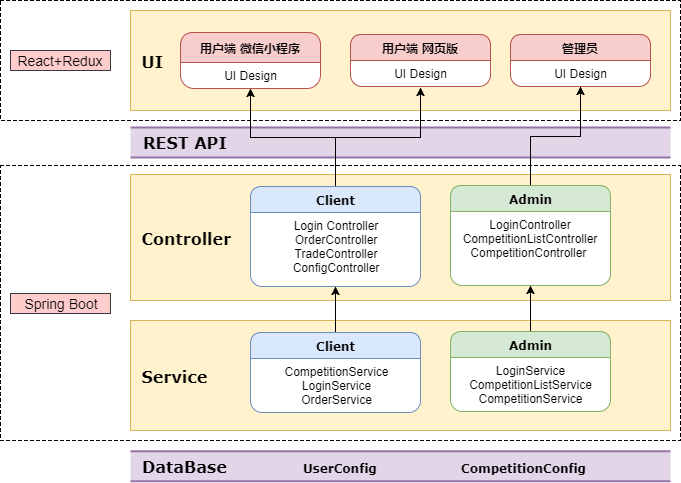

Server Code Structure
=================================

# configuration
spring boot权限等的基本配置

# security
信息安全性的配置

# admin
## controller
1. LoginController:提供管理员登录API
2. CompetitionListController:提供比赛列表相关API
3. CompetitionController:提供比赛详细信息API
## service
2. LoginService:用户登录相关
1. CompetitionListService:比赛列表相关（简化的比赛信息）
2. CompetitionService:比赛细节相关
## model
提供admin的数据类型
## repositories
封装与数据库交互API

# client
## controller
1. LoginController:提供用户登录API
2. OrderController:提供订单相关API
3. TradeController:提供双方交易API
3. ConfigController:提供队伍的财产信息和基本信息API
## service
1. CompetitionService:比赛相关（和admin的不一样）
2. LoginService:用户登录相关
2. OrderService:订单相关
## model
提供user（用户）的数据类型
## repositories
封装与数据库交互API
